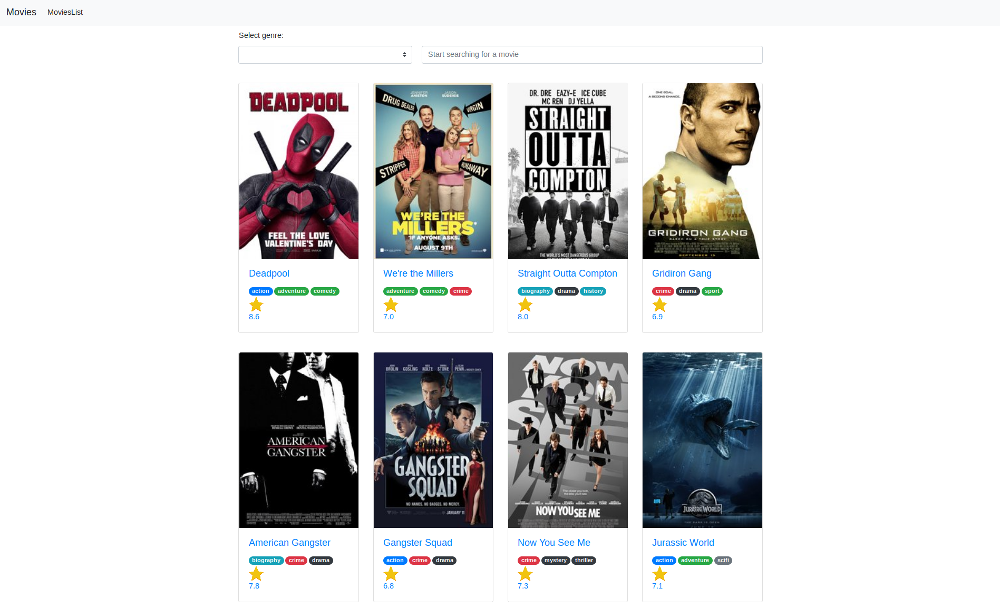
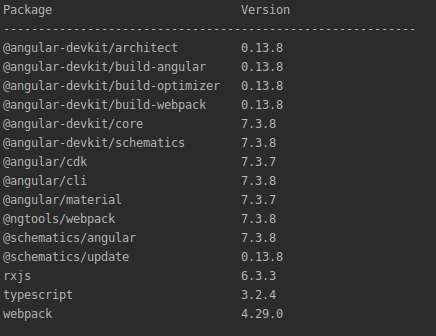

# AngMovies

Web application for movies collection built with Angular. App allows viewing movies collection, informations about a chosen movie (description, rating, length, genre, etc.), search for a movie, filter movies by genre. 
Live demo: https://workingangmovies.herokuapp.com/movies

## Prerequisites to run project
1. Angular CLI 7.3.8
2. Node: 10.15.3
3. npm: 6.4.1
- 

## Build

1. Clone git repo `git clone https://github.com/masini4ka/MoviesApp`
2. Locate to project directory `cd ang-movies`
3. Install dependencies `npm install`
4. Run `ng build`. The build artifacts will be stored in the `dist/` directory. The `--prod` flag for a production build.
5. Run application with `npm start` and go to `http://localhost:8000/` in browser of your choice.

